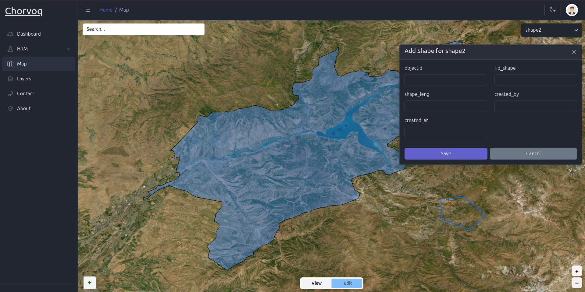
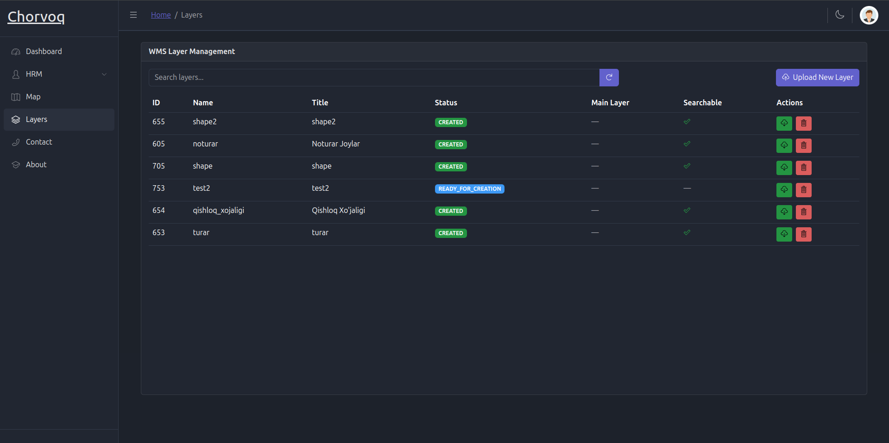

# Chorvoq GIS – Land Territory Management App

Chorvoq GIS is a full-stack web-based GIS (Geographic Information System) tool for managing land territories. It enables users to draw, label, and organize territorial boundaries on an interactive map. Ideal for government and businesses needing to track and manage land usage effectively.

---

## 🌍 Features

- 📍 **Add & Save Territories** – Draw custom polygon shapes on the map and label them.
- 🗂️ **Layer Management** – Organize shapes under map layers. Each map view is a separate "layer".
- 🔎 **Searchable Layers** – Quickly locate and manage map elements.
- ✅ **Status Tracking** – Monitor creation status of each layer.
- 🗺️ **GeoServer Map Integration** – Visualize maps using GeoServer and satellite imagery.
- 🧩 **Full Stack** – React frontend, Spring Boot backend, PostgreSQL database.

---

## 📸 Interface Preview

  
*Map with Drawing and Shape Management*


*Layer Management Panel*

---

## ⚙️ How It Works

1. **Upload Layer** – Add a new map layer (WMS) to the system.
2. **Draw Shape** – Mark territories on the map using polygon drawing tools.
3. **Add Metadata** – Fill in details like `objectid`, `fid_shape`, `created_by`, and more.
4. **Save & Display** – Shapes are saved in the database and visualized on the map.

Each **layer** contains multiple **shapes**, each linked to metadata and managed through the app.

---

## 🛠️ Tech Stack

- **Frontend**: React
- **Backend**: Spring Boot – [Backend Repository](https://github.com/MuhammadayubErkinoff/FinalProject.git)
- **Map Source**: GeoServer (WMS Layers)
- **Database**: PostgreSQL
- **Containerization**: Docker + Docker Compose

---

## 🚀 Getting Started

### 📦 Backend Setup

```bash
git clone https://github.com/MuhammadayubErkinoff/FinalProject.git
cd FinalProject
./mvnw package -DskipTests
docker compose build
docker compose up -d
```

This will build the Spring Boot backend, start PostgreSQL, and run all services.

### 💻 Frontend Setup

```bash
git clone https://github.com/Abdulhafiz0512/web2.git
cd web2
npm install
npm run dev
```

The frontend will be available at `http://localhost:3000`.

---

## 📂 Project Structure (Frontend)

```
web2/
├── css/
├── eslint.config.mjs
├── index.html
├── LICENSE
├── node_modules/
├── package.json
├── package-lock.json
├── public/
├── README.md
├── src/
│   ├── App.js
│   ├── index.js
│   ├── _nav.js
│   ├── routes.js
│   ├── app/
│   │   └── store.js
│   ├── assets/
│   │   ├── brand/
│   │   └── images/
│   ├── components/
│   │   ├── AppBreadcrumb.js
│   │   ├── AppContent.js
│   │   ├── AppFooter.js
│   │   ├── AppHeader.js
│   │   ├── AppSidebar.js
│   │   ├── AppSidebarNav.js
│   │   ├── DocsComponents.js
│   │   ├── DocsExample.js
│   │   ├── DocsIcons.js
│   │   ├── DocsLink.js
│   │   ├── header/
│   │   └── index.js
│   ├── features/
│   │   ├── access/
│   │   └── auth/
│   ├── layout/
│   │   └── DefaultLayout.js
│   ├── scss/
│   │   ├── _custom.scss
│   │   ├── _theme.scss
│   │   ├── _variables.scss
│   │   ├── examples.scss
│   │   ├── style.scss
│   │   └── vendors/
│   ├── utils/
│   │   ├── api/
│   │   └── navigation/
│   └── views/
│       ├── about/
│       ├── base/
│       ├── buttons/
│       ├── charts/
│       ├── contact/
│       ├── dashboard/
│       ├── departments/
│       ├── forms/
│       ├── layers/
│       ├── map/
│       ├── notifications/
│       ├── pages/
│       ├── profile/
│       ├── roles/
│       ├── theme/
│       ├── users/
│       └── widgets/
└── vite.config.mjs
```

---

## ✅ Future Improvements

- 📤 Export shapes as GeoJSON or PDF
- 🌐 Multilingual interface
- 📲 GPS location tracking & mobile support

---

## 🧑‍💼 Use Cases

- Government land allocation systems
- Business & agricultural land management
- Environmental monitoring zones
- Utility infrastructure mapping

---

## 🤝 Contributing

We welcome contributions! Fork the repo, make your changes, and submit a pull request.

---

## 📬 Contact

Developed by **Muhammadayub Erkinov**  
For inquiries or support, feel free to reach out!

---

## 📄 License

This project is open source and available under the [MIT License](LICENSE).
